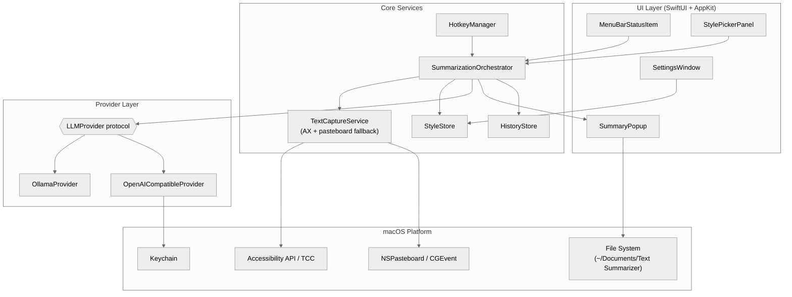
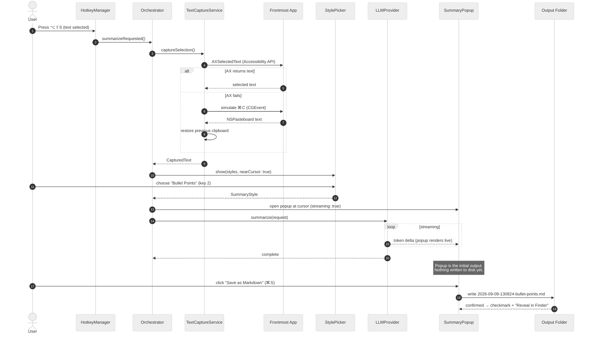
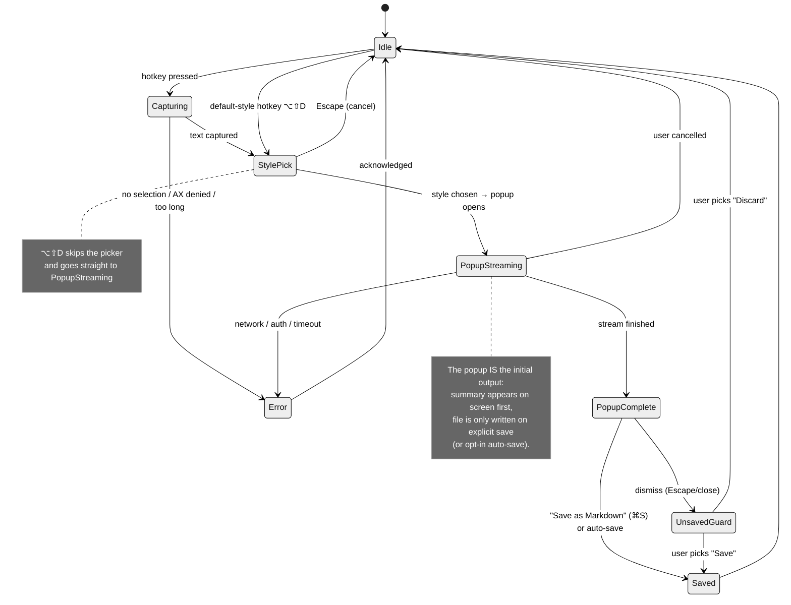

# Text Summarizer for macOS — Product Requirements Document & Implementation Plan

| Field | Value |
| :--- | :--- |
| **Document** | PRD + Technical Implementation Plan |
| **Product** | Text Summarizer (working title) |
| **Platform** | macOS 13 Ventura and later |
| **Version** | 1.0 (draft) |
| **Status** | Proposed |
| **Last updated** | 2026-09-09 |

---

## 1. Overview

Text Summarizer is a lightweight, menu-bar macOS utility that lets a user select text **in any application**, press a **global keyboard shortcut**, and receive an AI-generated summary within seconds. Summaries are produced by a user-configured LLM backend — either a local [Ollama](https://ollama.com) instance (default, fully private and offline) or any **OpenAI-compatible API** (OpenAI, OpenRouter, Groq, LM Studio, Azure OpenAI, etc.). The user picks *how* the text should be summarized (short summary, bullet points, and more).

The **initial output is always an on-screen popup** — a floating, non-intrusive panel that streams the summary in live, right next to where the user is reading. From that popup, the user can copy the result or **save it as a timestamped Markdown file** with one keystroke (⌘S). Nothing is written to disk unless the user saves (or has explicitly opted into auto-save).

The product philosophy: **one keystroke from reading to understanding**, with local-first privacy and zero vendor lock-in.

---

## 2. Problem Statement

Knowledge workers constantly read long content — emails, articles, PDFs, Slack threads, legal text, release notes. Existing solutions are fragmented:

- **Browser extensions** only work inside the browser.
- **Copy → open ChatGPT → paste → prompt** is a 6-step context switch that breaks flow.
- **Vendor tools** (Notion AI, Grammarly, etc.) lock users into subscriptions and send data to specific clouds with no option for local, private inference.

There is no fast, system-wide, provider-agnostic summarize button for macOS that respects privacy and the user's existing tools (plain Markdown files).

---

## 3. Goals and Success Metrics

### 3.1 Goals

| # | Goal | Success metric |
| :- | :--- | :--- |
| G1 | Summarize selected text from **any** macOS app with one shortcut | ≥ 95% capture success rate across top 20 tested apps |
| G2 | Time from keypress to visible summary feels instant | First streamed token visible < 2 s (Ollama, 8B model, Apple Silicon) |
| G3 | Provider freedom: local (Ollama) or any OpenAI-compatible endpoint | Both provider types fully working at v1.0 |
| G4 | User controls summary style | ≥ 5 built-in styles + custom prompts |
| G5 | Instant on-screen output, durable on demand | Summary appears in a popup at the cursor; one click/⌘S to a well-formed Markdown file; opt-in auto-save |
| G6 | Privacy by default | Works 100% offline with Ollama; API keys stored only in macOS Keychain; zero telemetry |

### 3.2 Non-Goals (v1.x)

- iOS / iPadOS / Windows / Linux versions.
- Summarizing images/screenshots (OCR) or audio/video.
- In-place *replacement* of the selected text (this is summarize-only; writing/rewrite tools are a possible v2.0).
- Cloud sync of history, accounts, or subscriptions.
- RAG over personal file libraries (a "summarize this file/URL" mode may be considered in v1.1+).

---

## 4. Personas and User Stories

### 4.1 Personas

| Persona | Description | Key need |
| :--- | :--- | :--- |
| **The Researcher** | Reads papers, long articles, reports all day | Quick TL;DRs saved as searchable Markdown notes |
| **The Privacy-Conscious Professional** | Handles confidential legal/medical/financial text | Local-only inference via Ollama; nothing leaves the machine |
| **The Developer/PM** | Lives in Slack, email, docs, tickets | Bullet-point digests of threads and specs without app-switching |
| **The Power User** | Already runs Ollama/LM Studio; uses multiple providers | Configurable endpoints, models, hotkeys, and prompt templates |

### 4.2 User Stories

| ID | As a… | I want to… | So that… |
| :- | :--- | :--- | :--- |
| US-1 | User | press one global shortcut with text selected in any app | I get a summary without copy/paste or switching apps |
| US-2 | User | choose the summary style (short, bullets, etc.) per request | the output matches my current need |
| US-3 | User | set a default style and skip the picker with a second shortcut | my common case is a single keystroke |
| US-4 | User | use my local Ollama models | my data never leaves my Mac and it works offline |
| US-5 | User | point the app at any OpenAI-compatible API with my own key | I can use GPT-4o, Groq, OpenRouter, LM Studio, etc. |
| US-6 | User | watch the summary stream into an on-screen popup as it generates | I get feedback immediately and can stop early |
| US-7 | User | save any summary from the popup as a Markdown file with one keystroke | it lands in my notes/docs workflow |
| US-8 | User | optionally auto-save summaries to a folder I choose | I never lose a result |
| US-9 | User | re-map the global shortcuts | they never conflict with my other apps |
| US-10 | User | see a friendly error when nothing is selected or the provider is down | I understand what happened and what to do |
| US-11 | Privacy-conscious user | have my API key in the macOS Keychain, never in plain files | my credentials are safe |
| US-12 | User | browse and re-export recent summaries | I can recover something I closed |

---

## 5. Functional Requirements

Priority: **P0** = MVP blocker, **P1** = v1.0, **P2** = v1.1+.

### 5.1 FR-1 — Global Text Capture

| ID | Requirement | Priority |
| :- | :--- | :- |
| FR-1.1 | A global hotkey (default **⌥⇧S**, user re-mappable) works from any application, including when Text Summarizer is not focused. | P0 |
| FR-1.2 | On hotkey press, the app reads the **currently selected text** from the frontmost app via the **macOS Accessibility API** (`AXUIElement` → focused element → `AXSelectedText`), without touching the clipboard. | P0 |
| FR-1.3 | If the Accessibility API returns nothing (unsupported app), the app falls back to simulating **⌘C** (via `CGEvent`), reading `NSPasteboard`, then **restoring the previous clipboard contents**. | P0 |
| FR-1.4 | A second global hotkey (default **⌥⇧D**) triggers summarization directly with the **default style**, skipping the style picker. | P1 |
| FR-1.5 | Both shortcuts are configurable through a recorder UI (click field, press new combination). Conflicts with existing system shortcuts are detected and flagged. | P1 |
| FR-1.6 | Empty/whitespace-only selections, and selections over a configurable limit (default 100,000 characters), produce clear user feedback (no silent failure). | P0 |
| FR-1.7 | The app never reads from password/secure text fields; secure fields are detectably rejected (`AXSelectedText` unavailable) and reported as "protected field". | P0 |

### 5.2 FR-2 — Summary Style Selection

| ID | Requirement | Priority |
| :- | :--- | :- |
| FR-2.1 | After capture (primary hotkey), a compact **style picker** appears near the mouse cursor or screen center listing all styles with keyboard shortcuts (1–9). | P0 |
| FR-2.2 | Built-in styles (see §6): **Short Summary**, **Bullet Points**, **Detailed Summary**, **Key Takeaways & Action Items**, **ELI5**, **Custom Prompt**. | P0 |
| FR-2.3 | The last-used style is remembered and offered as default; Escape cancels the whole operation with zero side effects. | P0 |
| FR-2.4 | Users can create, edit, reorder, and delete **custom styles** (name + prompt template with `{{text}}` placeholder) in Settings. | P1 |

### 5.3 FR-3 — LLM Provider Abstraction

| ID | Requirement | Priority |
| :- | :--- | :- |
| FR-3.1 | A provider layer supports two interchangeable backends behind one protocol: **Ollama** and **OpenAI-compatible**. The active provider is a Settings choice. | P0 |
| FR-3.2 | **Ollama**: configurable base URL (default `http://localhost:11434`); model dropdown populated live from `GET /api/tags`; generation via `POST /api/chat` with streaming. | P0 |
| FR-3.3 | **OpenAI-compatible**: configurable base URL (presets for OpenAI, OpenRouter, Groq, LM Studio + "Custom"), API key stored in **macOS Keychain**, model free-text or fetched from `GET /models`, generation via `POST /chat/completions` with SSE streaming. | P1 |
| FR-3.4 | All requests **stream** tokens to the UI as they arrive; the user can cancel mid-stream. | P0 |
| FR-3.5 | Configurable request timeout (default 120 s) and max output tokens (default 1024). | P1 |
| FR-3.6 | A "Test Connection" button in Settings validates reachability, auth, and model availability, showing actionable errors. | P1 |
| FR-3.7 | Per-provider system-prompt field (advanced) with a sane default. | P2 |

### 5.4 FR-4 — Result Popup & Markdown Output

> **Core interaction principle:** the initial output of every summarization is an **on-screen popup**. Nothing is written to disk until the user explicitly saves from the popup (unless the opt-in auto-save setting is enabled).

| ID | Requirement | Priority |
| :- | :--- | :- |
| FR-4.1 | The **initial and primary output** is a **popup panel shown on screen** the moment generation begins, appearing near the current mouse cursor (or screen center when the pointer position is unavailable). It is a floating, always-on-top, **non-activating** `NSPanel`: it renders Markdown live as tokens stream in and never steals focus from the app the user was working in. | P0 |
| FR-4.2 | The popup presents an explicit **"Save as Markdown" action** as its primary button (keyboard shortcut **⌘S**), alongside **Copy** (⌘C, plain Markdown), **Regenerate**, a style switcher (re-run with a different style), and a token/time stats footer. | P0 |
| FR-4.3 | **Save as Markdown** offers two paths: (a) one click writes the `.md` file per §7 to the configured output folder (default `~/Documents/Text Summarizer/`) with a timestamped filename `2026-09-09-130824-short-summary.md` and briefly confirms with a checkmark + "Reveal in Finder" link; (b) a **⌥⇧S / "Save As…"** variant opens a standard `NSSavePanel` so the user picks the location and filename. | P0 |
| FR-4.4 | Dismissing the popup (Escape or close button) **discards nothing silently**: if the summary was never saved, a lightweight "Unsaved summary — Save / Discard" prompt appears. Discarding requires an explicit choice. | P1 |
| FR-4.5 | **Auto-save** is an opt-in Settings toggle (default **off**). When on, completed summaries are written to the output folder automatically and the popup shows a "Saved" badge; the popup remains the visible output regardless. | P1 |
| FR-4.6 | Only one popup is active at a time by default; a new hotkey press while a popup is open replaces its content (with the unsaved-changes guard of FR-4.4 applied). | P1 |
| FR-4.7 | The popup is resizable, remembers its last size/position per display, supports dark/light mode, and remains fully keyboard-operable and VoiceOver-labeled. | P1 |
| FR-4.8 | Optional completion notification when the popup is not visible (e.g., user switched spaces mid-stream). | P2 |

### 5.5 FR-5 — Application & Settings

| ID | Requirement | Priority |
| :- | :--- | :- |
| FR-5.1 | The app is a **menu-bar agent** (`LSUIElement`): no Dock icon, no windows unless invoked; status item shows state (idle/busy/error) and a menu (Summarize with default style, Recent, Settings, Quit). | P0 |
| FR-5.2 | **Launch at login** toggle. | P1 |
| FR-5.3 | Settings tabs: **General** (hotkeys, launch at login, limits), **Styles** (manage templates), **Providers** (Ollama / OpenAI-compatible, test connection), **Output** (folder, auto-save, filename template), **About** (version, privacy note). | P1 |
| FR-5.4 | All settings persist in `UserDefaults`; API keys only in Keychain; no config leaves the device. | P0 |
| FR-5.5 | First-run onboarding: grant Accessibility permission (deep link into System Settings), pick provider, pick default style — completable in < 2 minutes. | P1 |

### 5.6 FR-6 — History

| ID | Requirement | Priority |
| :- | :--- | :- |
| FR-6.1 | The last 100 summaries (capped, FIFO) are stored locally: source excerpt, style, provider/model, full Markdown output, timestamps. | P2 |
| FR-6.2 | History browser with search; one-click re-copy or re-export to Markdown. | P2 |
| FR-6.3 | "Clear history" and per-item delete. | P2 |

---

## 6. Summary Styles Specification

Each style is a prompt template. `{{text}}` is replaced by the captured selection. Style definitions are data, not code, so users can edit them.

| Style | Shortcut | Behavior | Prompt template (excerpt) |
| :--- | :- | :--- | :--- |
| **Short Summary** | `1` | 2–4 sentence TL;DR | "Summarize the following text in 2–4 concise sentences. Output only the summary.\n\n{{text}}" |
| **Bullet Points** | `2` | 3–8 Markdown bullets | "Distill the following text into 3–8 crisp Markdown bullet points. No preamble.\n\n{{text}}" |
| **Detailed Summary** | `3` | Multi-paragraph with section headings if source is long | "Write a detailed summary of the following text using Markdown headings where appropriate…\n\n{{text}}" |
| **Key Takeaways & Action Items** | `4` | `## Takeaways` + `## Action Items` sections | "Extract key takeaways and any action items from the following text…\n\n{{text}}" |
| **ELI5** | `5` | Plain-language explanation for a beginner | "Explain the following text in simple terms a non-expert would understand…\n\n{{text}}" |
| **Custom Prompt…** | `0` | Inline text field; template saved on use | User-defined, must contain `{{text}}` |

System prompt (default, provider-agnostic):

```text
You are a precise summarization engine. Follow the user's instructions exactly.
Never add information not present in the source. Respond in Markdown.
```

---

## 7. Markdown Output Format

Every saved file is self-describing via YAML frontmatter.

```markdown
---
title: "Short Summary — 2026-09-09 13:08"
created: 2026-09-09T13:08:24+02:00
style: short-summary
provider: ollama
model: llama3.1:8b
source_app: "Safari"
source_characters: 4821
summary_characters: 512
duration_seconds: 3.4
---

# Short Summary

The European Central Bank held rates steady …

---

<details>
<summary>Source text (4,821 characters)</summary>

…original captured text…

</details>
```

Rules:

- Frontmatter keys are stable; `provider`, `model`, `style` always present.
- The summary body is exactly what the model returned (no silent editing).
- The source excerpt is included under a collapsed `<details>` block by default (toggleable in Settings → Output).
- Filenames: `yyyy-MM-dd-HHmmss-<style-slug>.md`, collision-safe (append `-2`, `-3`, …).

---

## 8. Technical Architecture

### 8.1 Stack Decision

| Decision | Choice | Rationale |
| :--- | :--- | :--- |
| Language / UI | **Swift 5.9+, SwiftUI + AppKit interop** | Native performance, first-class Accessibility/Keychain/pasteboard APIs, small binary (~5 MB), no runtime dependencies |
| App model | Menu-bar agent (`LSUIElement = YES`) | Utility that lives behind a hotkey; Dock presence would be noise |
| Global hotkeys | [`KeyboardShortcuts`](https://github.com/sindresorhus/KeyboardShortcuts) (SPM) | Modern, sandbox-friendly, recorder UI included; avoids deprecated Carbon `RegisterEventHotKey` plumbing |
| Text capture | Accessibility API + `CGEvent` ⌘C fallback | See FR-1; AX path never disturbs the clipboard |
| Networking | `URLSession` + `bytes(for:)` (Swift Concurrency) | Native SSE/NDJSON streaming without WebSocket libraries |
| Key storage | Keychain (`SecItem*`) via thin wrapper | OS-grade secret storage; never on disk in plain text |
| Markdown rendering | [`MarkdownUI`](https://github.com/gonzalezreal/swift-markdown-ui) (SPM) | High-quality SwiftUI Markdown with minimal effort |
| Minimum OS | macOS 13 Ventura | Broad coverage; revisit to macOS 14 if `Observable` adoption justifies it |
| Distribution | Developer ID + notarization (outside App Store) | App Sandbox makes simulated ⌘C and some AX flows impractical; notarized direct distribution is the standard for this class of tool. Sparkle auto-updates in v1.1. |

### 8.2 Module Breakdown



Key types (protocol-first, all testable):

```swift
protocol TextCapturing {
    /// Returns selected text and the source app's bundle name.
    func captureSelection() async throws -> CapturedText
}

protocol LLMProvider: Sendable {
    var displayName: String { get }
    func listModels() async throws -> [String]
    /// Streams partial deltas of the completion.
    func summarize(_ request: SummaryRequest) -> AsyncThrowingStream<String, Error>
}

struct SummaryRequest: Sendable {
    let style: SummaryStyle        // prompt template
    let text: String               // captured selection
    let model: String
    let maxTokens: Int
    let temperature: Double        // default 0.2 — deterministic summaries
}

enum CaptureError: Error {
    case accessibilityNotGranted
    case noSelection
    case secureField
    case selectionTooLong(limit: Int)
}
```

### 8.3 End-to-End Sequence



### 8.4 Request Lifecycle (State Machine)



### 8.5 Provider API Specifications

**Ollama** — chat with streaming (NDJSON, one JSON object per line):

```http
POST http://localhost:11434/api/chat
Content-Type: application/json

{
  "model": "llama3.1:8b",
  "messages": [
    {"role": "system", "content": "You are a precise summarization engine…"},
    {"role": "user", "content": "<style prompt with {{text}} substituted>"}
  ],
  "stream": true,
  "options": {"temperature": 0.2, "num_predict": 1024}
}
```

Model discovery: `GET /api/tags` → `{ "models": [{ "name": "llama3.1:8b", … }] }`.

**OpenAI-compatible** — SSE streaming (`data:` lines, terminated by `data: [DONE]`):

```http
POST {baseURL}/chat/completions
Authorization: Bearer <key from Keychain>
Content-Type: application/json

{
  "model": "gpt-4o-mini",
  "messages": [ …same shape… ],
  "stream": true,
  "max_tokens": 1024,
  "temperature": 0.2
}
```

Presets ship in Settings: OpenAI (`https://api.openai.com/v1`), OpenRouter (`https://openrouter.ai/api/v1`), Groq (`https://api.groq.com/openai/v1`), LM Studio (`http://localhost:1234/v1`), plus fully custom base URLs.

### 8.6 Permissions & Privacy

| Item | Detail |
| :--- | :--- |
| **Accessibility permission** | Required for AX text capture and simulated ⌘C. Requested on first run via `AXIsProcessTrustedWithOptions`; deep-link button into System Settings → Privacy & Security → Accessibility. App re-checks on every hotkey press and guides the user if revoked. |
| **Network** | Ollama path: loopback only. OpenAI path: only the configured base URL. No analytics, crash reporting, or update pings in v1.0. |
| **Data at rest** | History (v1.1) in `~/Library/Application Support/Text Summarizer/`; saved `.md` files only where the user chose. |
| **Secrets** | API keys in Keychain with `kSecAttrAccessibleWhenUnlocked`; never logged. |
| **Logging** | `os_log` with `%{private}` redaction; captured text and summaries are never logged. |

---

## 9. Non-Functional Requirements

| Category | Requirement |
| :--- | :--- |
| **Performance** | Hotkey → picker visible < 300 ms; first streamed token < 2 s on M-series with a warm 7–8B Ollama model; app idle memory < 80 MB. |
| **Reliability** | Graceful degradation AX → ⌘C fallback; no crash path that loses an in-flight summary without offering recovery (popup keeps partial stream). |
| **Offline** | Full functionality with Ollama and no network. |
| **Accessibility (a11y)** | Full keyboard operation of picker/panel/settings; VoiceOver labels on all controls; respects Reduce Motion. |
| **Localization** | English v1.0; all strings via `String Catalogs` for future localization. |
| **Compatibility** | macOS 13+, Apple Silicon and Intel. Verified capture in: Safari, Chrome, Mail, Notes, Slack, VS Code, Pages, Preview, Finder, Messages. |

---

## 10. Error Handling Matrix

| Failure | Detection | User-facing behavior |
| :--- | :--- | :--- |
| Accessibility not granted | `AXIsProcessTrusted()` on hotkey | Modal explainer + "Open System Settings" button |
| Nothing selected | Empty `AXSelectedText` **and** unchanged pasteboard | Toast: "No text selection found" |
| Password/secure field | AX attribute unavailable | Toast: "Can't read protected fields" |
| Selection > limit | Char count check | Alert with "Summarize anyway" / "Cancel" |
| Ollama not running | `GET /api/tags` connection refused | Panel error state + "Start Ollama" / "Retry" + docs link |
| Model not pulled | `404` from `/api/chat` | Error + suggested `ollama pull <model>` command (copy button) |
| Invalid API key | `401` | Error + deep link to Settings → Providers |
| Rate limited / server error | `429` / `5xx` | Error + exponential-backoff "Retry" (max 2 automatic retries) |
| Timeout | `async withThrowingTaskGroup` deadline | Error showing partial stream preserved |
| Disk write failure | `FileManager` throw | Alert + "Choose another folder" |

---

## 11. Implementation Plan

### Phase 0 — Spike (2–3 days) — *de-risk the unknowns*

- [ ] Verify AX `AXSelectedText` capture across the 10 target apps; catalog which need the ⌘C fallback.
- [ ] Verify `KeyboardShortcuts` global capture while another app is focused.
- [ ] Verify Ollama `/api/chat` NDJSON streaming via `URLSession.bytes`.
- [ ] Verify non-activating `NSPanel` shows over full-screen apps.

### Phase 1 — MVP (≈ 2 weeks)

- [ ] App skeleton: menu-bar agent, status item, `LSUIElement`.
- [ ] `TextCaptureService` (AX + ⌘C fallback + clipboard restore) with `CaptureError` taxonomy.
- [ ] `HotkeyManager` with ⌥⇧S; permission onboarding flow.
- [ ] `OllamaProvider` (models list + streaming chat).
- [ ] `StylePickerPanel` with the 6 built-in styles.
- [ ] `SummaryPopup` (non-activating `NSPanel` at cursor) with MarkdownUI streaming render, **Save as Markdown** (⌘S, one-click to output folder + "Save As…" variant), Copy, Regenerate.
- [ ] Markdown writer per §7 (frontmatter, filename scheme) to default output folder.
- [ ] Unit tests: prompt templating, NDJSON/SSE parsers, filename/frontmatter generator, error mapping.

### Phase 2 — Provider Freedom (≈ 1 week)

- [ ] `OpenAICompatibleProvider` (SSE streaming, auth header, presets).
- [ ] Keychain wrapper + Settings → Providers tab with Test Connection.
- [ ] ⌥⇧D default-style hotkey; hotkey recorder UI in Settings.
- [ ] Custom style editor (create/edit/reorder/delete templates).
- [ ] Settings → Output (folder picker, auto-save, include-source toggle).

### Phase 3 — Polish & Release (≈ 1 week)

- [ ] History store + browser (FR-6).
- [ ] Stats footer (tokens, duration), retry-with-backoff, edge-case UX sweep.
- [ ] Icon, about panel, onboarding copy, privacy page.
- [ ] Notarization + DMG packaging; (v1.1) Sparkle updates.
- [ ] Test matrix pass (§12), performance budget check.

**Total estimate:** ~4–5 weeks for one developer. MVP usable after Phase 1.

### Milestone exit criteria

| Milestone | Exit criteria |
| :--- | :--- |
| **M1 (MVP)** | Select text in Safari → ⌥⇧S → Bullets → **summary streams into an on-screen popup** → ⌘S saves `.md` with correct frontmatter; nothing written to disk before the save; works offline via Ollama. |
| **M2** | Same flow against OpenAI-compatible endpoint with Keychain-stored key; custom style saved and used; ⌥⇧D one-keystroke flow. |
| **M3** | History browse/re-export; notarized DMG; test matrix green; zero known P0/P1 bugs. |

---

## 12. Testing Plan

| Layer | Approach | Highlights |
| :--- | :--- | :--- |
| **Unit** | XCTest | Prompt template substitution; NDJSON/SSE stream parsers (recorded fixtures); frontmatter/filename generation incl. collisions; clipboard save/restore round-trip; Keychain wrapper (ephemeral keychain). |
| **Provider contract tests** | Shared test suite run against `LLMProvider` concretions | Same assertions for Ollama + OpenAI-compatible using `URLProtocol` stubs — no network in CI. |
| **Integration** | Local Ollama with a tiny model (`qwen2.5:0.5b`) | End-to-end capture→summary on a test fixture app (TextEdit) via `XCUITest`-driven selection. |
| **Manual matrix** | Checklist | 10 target apps × (AX path, ⌘C fallback); full-screen apps; multi-display; permission revoked mid-flight; Ollama stopped mid-stream; 100k-char selection. |
| **Performance** | Instruments | Cold launch < 1 s; idle memory < 80 MB; no retain cycles across 100 summaries. |

---

## 13. Risks and Mitigations

| Risk | Impact | Mitigation |
| :--- | :--- | :--- |
| Apps that expose no AX text and block ⌘C (rare, e.g., some secure viewers) | Capture fails for those apps | Friendly failure message; documented limitation; v2 could add screenshot+OCR capture |
| User revokes Accessibility permission | Core flow breaks | Detect on every hotkey; one-click re-grant guidance |
| ⌘C fallback collides with apps using ⌘C for non-copy | Wrong content captured | AX-first ordering; 500 ms pasteboard-change window; restore clipboard always |
| Ollama model quality varies | Poor summaries on small models | Ship recommended-model list in onboarding; default style prompts tuned for small models |
| OpenAI-compatible quirks (Azure paths, non-standard SSE) | Provider errors | Presets + custom base URL; parser tolerant of `data:` framing variants; contract tests |
| macOS Sequoia+ permission UX churn (weekly re-prompts for screen/AX utilities) | User friction | Track latest macOS betas each cycle; prefer AX-only path where possible |

---

## 14. Alternatives Considered

| Alternative | Why not |
| :--- | :--- |
| **Electron / Tauri** | No first-class Accessibility API access; heavier; hotkey/AX integration would still require native modules. Swift is the right tool. |
| **macOS Services menu / Automator Quick Action** | No code signing/notarization headaches, but clunky UX (right-click → Services submenu), no streaming UI, no style picker, poor discoverability. Rejected as the primary UX; may ship as a bonus integration later. |
| **PopClip extension** | Requires PopClip install; limited UI surface. Possible future distribution channel, not the core product. |
| **Clipboard-only capture (no AX)** | Simpler, but clobbers the clipboard and fails where ⌘C ≠ copy. AX-first is worth the complexity. |
| **App Store distribution** | Sandbox blocks simulated ⌘C and complicates AX workflows; notarized direct distribution chosen. |

---

## 15. Open Questions

1. **Default hotkey** — ⌥⇧S / ⌥⇧D proposed; final defaults after conflict testing on a stock macOS install.
2. **Output folder default** — `~/Documents/Text Summarizer/` proposed; confirm preferred naming ("Docs folder" wording in the original request is interpreted as the user's Documents folder, configurable in Settings → Output).
3. **History in v1.0 or v1.1?** — Currently P2; pulling it into v1.0 adds ~2 days.
4. **License & distribution** — OSS (MIT) vs freeware; affects Sparkle/GitHub Releases wiring.
5. **"Summarize this file/URL" mode** — drag-and-drop onto the menu bar icon; scoped for v1.1 pending MVP feedback.

---

## 16. Appendix

### A. Example Settings (persisted model)

```json
{
  "shortcuts": { "summarize": "⌥⇧S", "summarizeDefault": "⌥⇧D" },
  "defaultStyle": "bullet-points",
  "activeProvider": "ollama",
  "ollama": { "baseURL": "http://localhost:11434", "model": "llama3.1:8b" },
  "openAI": { "baseURL": "https://api.openai.com/v1", "model": "gpt-4o-mini" },
  "output": {
    "folder": "~/Documents/Text Summarizer",
    "autoSave": false,
    "includeSource": true
  },
  "limits": { "maxSelectionChars": 100000, "maxTokens": 1024, "timeoutSeconds": 120 }
}
```

### B. Recommended Ollama models (onboarding defaults)

| Model | Size | Why |
| :--- | :--- | :--- |
| `llama3.1:8b` | ~4.7 GB | Best quality/speed balance on Apple Silicon |
| `qwen2.5:3b` | ~1.9 GB | Fast on older Macs, good instruction following |
| `phi3:mini` | ~2.3 GB | Strong short-summary performance, low RAM |
