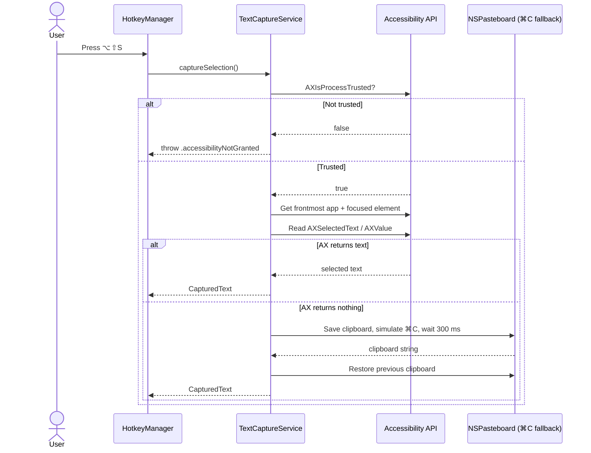

# TextSummarizer — Handoff Document: Milestone 1

**Date:** 2026-09-10  
**Commit:** `a30e58f` on `main`  
**Status:** Milestone 1 complete. Build succeeds. Global hotkey text capture works in Safari/Notes/TextEdit and Microsoft Word (via ⌘C fallback).

---

## 1. What Was Built

Milestone 1 implements the smallest usable slice of the product:

- A **menu-bar-only macOS agent** (no Dock icon, no main window).
- A **global hotkey** (`⌥⇧S`) that works while another app is focused.
- **Text capture** from the frontmost app using the Accessibility API.
- A **⌘C + pasteboard fallback** with clipboard restore, for apps like Microsoft Word that do not expose `AXSelectedText`.
- A minimal **menu-bar dropdown** (Summarize Selection, Settings placeholder, Quit).
- **User-facing errors** for missing Accessibility permission, no selection, secure fields, and overly long selections.
- **Project configuration fixes**: deployment target macOS 13.0, App Sandbox disabled, entitlements file created, `.gitignore` added.

This milestone intentionally does **not** include: style picker, LLM providers, summary popup, Markdown saving, settings persistence beyond defaults, or history. Those are planned for subsequent milestones.

---

## 2. Project Structure

```text
TextSummarizer/
├── TextSummarizer.xcodeproj/          # Xcode project
│   └── project.xcworkspace/xcshareddata/swiftpm/Package.resolved
├── TextSummarizer/
│   ├── App/
│   │   └── TextSummarizerApp.swift    # @main entry point, MenuBarExtra
│   ├── Core/
│   │   ├── HotkeyManager.swift        # Global ⌥⇧S registration & handling
│   │   └── TextCaptureService.swift   # AX capture + ⌘C fallback
│   ├── Models/
│   │   ├── CapturedText.swift         # text + sourceAppName
│   │   └── CaptureError.swift         # error taxonomy
│   ├── UI/
│   │   └── MenuBar/
│   │       └── MenuBarStatusView.swift # Dropdown menu UI
│   ├── Info.plist                     # LSUIElement = true
│   └── TextSummarizer.entitlements    # Sandbox disabled
├── Docs/
│   ├── PRD.md                         # Full product requirements
│   ├── setup-guide.md                 # Setup and build instructions
│   └── handoff-milestone-1.md         # This file
└── .gitignore
```

### File reference

| File | Responsibility |
| :--- | :--- |
| `App/TextSummarizerApp.swift` | Owns `HotkeyManager` as a `@StateObject`; renders the `MenuBarExtra` scene. |
| `Core/HotkeyManager.swift` | Registers the global shortcut with `KeyboardShortcuts`; forwards trigger to `TextCaptureService`; prints results/errors. |
| `Core/TextCaptureService.swift` | Implements `TextCapturing` protocol. Tries AX first, then simulates ⌘C and restores clipboard. |
| `Models/CapturedText.swift` | Simple data holder: captured text and source app name. |
| `Models/CaptureError.swift` | `LocalizedError` cases with friendly messages. |
| `UI/MenuBar/MenuBarStatusView.swift` | SwiftUI dropdown shown from the menu-bar icon. |

---

## 3. How It Works

### Capture flow



### Key implementation details

- `AXIsProcessTrustedWithOptions` is called with the literal key `"AXTrustedCheckOptionPrompt"` to avoid import-version mismatch issues.
- The ⌘C fallback posts `CGEvent` key events for the `c` key with the Command modifier.
- Clipboard restore copies all pasteboard item types back, not just plain text, so images or rich content are preserved.
- Secure fields are detected by checking `kAXSubroleAttribute` for `"AXSecureTextField"`.

---

## 4. Current State & Verification

### Build

- Clean build succeeds in Xcode.
- Deployment target is macOS 13.0.
- App Sandbox is disabled (required for AX + simulated ⌘C).
- Swift packages resolved: `KeyboardShortcuts`, `MarkdownUI`, `NetworkImage`, `swift-cmark`.

### Manual tests that passed

| App | Method | Result |
| :--- | :--- | :--- |
| Safari | Accessibility | ✅ Captures selected text |
| Notes | Accessibility | ✅ Captures selected text |
| TextEdit | Accessibility | ✅ Captures selected text |
| Microsoft Word | ⌘C fallback | ✅ Captures selected text |
| No selection | — | ✅ Shows "No text selection found" |
| Password field | — | ✅ Shows "Can't read protected fields" |

### Known limitations

1. **No persistent settings.** Hotkey is hardcoded to `⌥⇧S`. Customization comes in Milestone 2.
2. **Output is console-only.** Summaries are printed via `print()`. There is no popup, style picker, or file saving yet.
3. **Permission requires full restart.** After granting Accessibility permission, the app must be fully quit and relaunched before `AXIsProcessTrusted` returns `true`.
4. **⌘C fallback timing.** The current delay is 300 ms. Very slow apps may need a longer delay or a polling loop.
5. **No history.** Nothing is stored to disk except the commit itself.
6. **No second shortcut.** `⌥⇧D` for default-style summarization is not implemented yet.

---

## 5. Recommended Next Steps

The PRD describes three phases. Milestone 1 maps roughly to the AX/hotkey slice of **Phase 1**. The next logical increments are:

### Increment A — Style picker (small UI)

**Goal:** After capturing text, show a compact style picker near the cursor.

- Create `Models/SummaryStyle.swift` with the six built-in styles from §6 of the PRD.
- Create `Stores/StyleStore.swift` to hold built-in + custom styles.
- Create `UI/StylePicker/StylePickerPanel.swift` as a non-activating `NSPanel`.
- Wire `HotkeyManager` → `StylePicker` → `SummarizationOrchestrator` (new).

**Definition of done:** Press `⌥⇧S` with text selected → picker appears with styles 1–6 → pressing `2` (Bullets) prints the bullet prompt to the console.

### Increment B — Ollama provider

**Goal:** Send the selected text + style to a local Ollama instance and stream the response.

- Create `Providers/LLMProvider.swift` protocol.
- Create `Providers/OllamaProvider.swift`.
- Implement `GET /api/tags` for model listing.
- Implement `POST /api/chat` with NDJSON streaming via `URLSession.bytes(for:)`.
- Create `Models/SummaryRequest.swift`.
- Create `Utilities/StreamParsers.swift` for NDJSON line parsing.

**Definition of done:** Select text → pick style → see Ollama response tokens printed to the console as they arrive.

### Increment C — Summary popup

**Goal:** Replace console output with a floating popup that streams Markdown live.

- Create `UI/Popup/SummaryPopup.swift` (non-activating `NSPanel`).
- Use `MarkdownUI` to render streaming Markdown.
- Add Copy (`⌘C`) and Regenerate actions.

**Definition of done:** Summarization result appears in a popup at the cursor instead of the console.

### Increment D — Save as Markdown

**Goal:** Allow the user to save the popup content as a timestamped `.md` file.

- Create `Utilities/MarkdownWriter.swift` with YAML frontmatter per §7 of the PRD.
- Add "Save as Markdown" (`⌘S`) and "Save As…" (`⌥⇧S`) actions to the popup.
- Default folder: `~/Documents/Text Summarizer/`.

**Definition of done:** Press `⌘S` in the popup → a `.md` file is written with correct frontmatter and filename format.

### Increment E — Settings foundation

**Goal:** Add a Settings window and persistence.

- Create `Stores/SettingsStore.swift` (UserDefaults wrapper).
- Create `UI/Settings/SettingsWindow.swift` and tab views.
- Add provider configuration (Ollama base URL/model).
- Add hotkey recorder UI (`KeyboardShortcuts.RecorderCocoa`).

---

## 6. Important Notes for the Next Session

### Before you run

1. Open `TextSummarizer.xcodeproj` in Xcode.
2. Select **My Mac** as the run destination.
3. Build with `Command-B`.
4. Run with `Command-R`.
5. The first run will prompt for Accessibility permission.
6. **Quit the app completely**, grant permission in System Settings, then relaunch.

### If capture stops working

- Check that Accessibility permission is still enabled for TextSummarizer.
- Note that Xcode rebuilds change the binary path; macOS may require you to remove and re-add the app in Accessibility settings.
- Check the Xcode console for the diagnostic prints:
  - `Accessibility trusted: true/false`
  - `Frontmost app: <name>`
  - `Captured via Accessibility` / `Falling back to clipboard ⌘C`
  - `Clipboard after ⌘C: <count> characters`

### If you need to reset permissions

1. System Settings → Privacy & Security → Accessibility.
2. Remove TextSummarizer.
3. Re-add it by clicking `+` and selecting the built app in `~/Library/Developer/Xcode/DerivedData/.../Build/Products/Debug/TextSummarizer.app`.
4. Relaunch.

---

## 7. Code Patterns to Follow

- Keep the **protocol-first** architecture (`TextCapturing`, `LLMProvider` next).
- Mark Apple-platform entry points (`captureSelection`, SwiftUI views) with `@MainActor` where needed, but avoid making whole types `@MainActor` unless necessary.
- Use `Sendable` conformance for models that cross async boundaries.
- Add user-facing `LocalizedError` messages for all failure modes.
- Avoid hardcoding secrets; API keys go in Keychain later.

---

## 8. Open Questions from the PRD

1. **Default hotkey:** Currently `⌥⇧S`. Conflicts should be checked on a stock macOS install.
2. **Output folder:** Default is `~/Documents/Text Summarizer/`; confirm naming.
3. **History:** Marked P2 in the PRD. Decide whether to include in v1.0 or v1.1.
4. **License/distribution:** MIT recommended for open source + Homebrew.
5. **⌘C fallback delay:** Currently 300 ms. Test with more apps and adjust if needed.

---

## 9. Useful Commands

```bash
# Build from command line (requires Xcode active developer directory)
xcodebuild -project TextSummarizer.xcodeproj -scheme TextSummarizer -destination 'platform=macOS' build

# Check git status
git status --short

# View recent commits
git log --oneline -10
```

---

## 10. Contact Context

This handoff was generated after a session that:
- Planned Milestone 1.
- Implemented all source files.
- Iteratively fixed Swift 6 strict-concurrency and Accessibility API compile errors.
- Verified capture in Safari, Notes, TextEdit, and Microsoft Word.
- Committed the result as `[MILESTONE-1]: implement global hotkey text capture for menu-bar agent`.

The next session should probably start with **Increment A — Style picker** unless there is a reason to jump straight to the provider layer.
