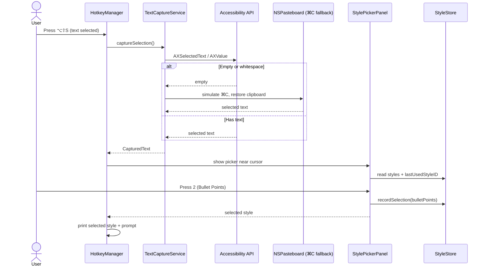

# TextSummarizer — Handoff Document: Milestone 2, Increment A

**Date:** 2026-09-10  
**Commit:** `a364edc` on `main`  
**Status:** Increment A complete. Build succeeds. Style picker appears after global hotkey capture and works in Safari, Microsoft Word, and VS Code.

---

## 1. What Was Built

Increment A adds a **style picker** that appears after the user presses the global summarize shortcut (`⌥⇧S`) and text is successfully captured.

- Six built-in summary styles (Short Summary, Bullet Points, Detailed Summary, Key Takeaways & Action Items, ELI5, Custom Prompt).
- Each style has a shortcut key (`1`–`6` and `0`).
- The picker appears as a compact, non-activating floating panel near the mouse cursor.
- The last-used style is highlighted and persisted across launches.
- `Escape` cancels the operation.

This increment intentionally does **not** send anything to an LLM yet. Selecting a style prints the generated prompt to the console so the next increment can wire in the provider.

---

## 2. New Files

| File | Responsibility |
| :--- | :--- |
| `Models/SummaryStyle.swift` | Defines a summary style: `id`, `name`, `shortcutKey`, `promptTemplate`. Builds the final prompt by replacing `{{text}}`. |
| `Stores/StyleStore.swift` | Holds the built-in styles, remembers the last-used style in `UserDefaults`, and provides lookups by ID or shortcut key. |
| `UI/StylePicker/StylePickerView.swift` | SwiftUI list of styles with keyboard shortcuts and a Cancel row. |
| `UI/StylePicker/StylePickerPanel.swift` | Non-activating `NSPanel` wrapper that positions the picker near the cursor and receives key events. |

## 3. Modified Files

| File | Changes |
| :--- | :--- |
| `Core/TextCaptureService.swift` | Fixed VS Code capture bug: empty/whitespace Accessibility text is now treated as missing, triggering the `⌘C` fallback. |
| `Core/HotkeyManager.swift` | After capture, shows the style picker instead of printing captured text to the console. |
| `App/TextSummarizerApp.swift` | Creates a single `StyleStore` and shares it with `HotkeyManager`. |

---

## 4. How It Works

### Flow

### Key implementation details

- `SummaryStyle.shortcutKey` is a `String` rather than `Character` to avoid SwiftUI `ForEach` and `KeyEquivalent` type-inference failures.
- `StylePickerPanel` uses a private `KeyablePanel` subclass of `NSPanel` that overrides `canBecomeKeyWindow` to `true` so digit keys and Escape work without warnings.
- The panel is borderless and non-activating so it does not steal focus from the user's current app.
- The last-used style is persisted via `UserDefaults` under `com.textsummarizer.lastUsedStyleID`.

---

## 5. Current State & Verification

### Build

- Clean build succeeds in Xcode.
- Deployment target remains macOS 13.0.
- App Sandbox is disabled (required for AX + simulated ⌘C).

### Manual tests that passed

| App | Method | Result |
| :--- | :--- | :--- |
| Safari | Accessibility | ✅ Picker appears, style selectable |
| Microsoft Word | ⌘C fallback | ✅ Picker appears, style selectable |
| VS Code | ⌘C fallback (after AX fix) | ✅ Picker appears, style selectable |
| No selection | — | ✅ "No text selection found" |
| Escape | — | ✅ Picker closes, no action |

### Known limitations

1. **Output is console-only.** Selecting a style prints the prompt to the console. The LLM call and popup UI are Increment B and C.
2. **Custom Prompt is a placeholder.** It uses a generic template; the inline editing UI comes later.
3. **Settings not yet configurable.** Hotkey and styles are not yet editable through a UI.
4. **Only one picker at a time.** A new hotkey press while the picker is open replaces it, which is intentional.

---

## 6. Bugs Fixed During This Increment

### VS Code empty Accessibility text

**Symptom:** In VS Code, `AXSelectedText` returned an empty string, which the code treated as a successful capture. The app then reported "No text selection found".

**Fix:** In `TextCaptureService.tryCaptureViaAccessibility`, empty or whitespace-only strings from `AXSelectedText` and `AXValue` are now treated as `nil`, so the `⌘C` fallback runs.

### `ForEach` / `KeyEquivalent` inference failure with `Character`

**Symptom:** Using `Character` for `shortcutKey` caused SwiftUI to pick a `Binding` overload of `ForEach`, leading to cascading type errors.

**Fix:** Changed `shortcutKey` to `String` and used `ForEach(styles, id: \.id)`. `KeyEquivalent` is created only at the call site with `Character(style.shortcutKey)`.

### `makeKeyWindow` warning on `NSPanel`

**Symptom:** Console warning: `-[NSWindow makeKeyWindow] called on <NSPanel> which returned NO from -[NSWindow canBecomeKeyWindow]`.

**Fix:** Added a private `KeyablePanel: NSPanel` subclass that overrides `canBecomeKeyWindow` to `true`.

---

## 7. Recommended Next Steps

Increment A is complete. The next logical increment is **Increment B — Ollama provider**:

1. Create `Providers/LLMProvider.swift` protocol.
2. Create `Providers/OllamaProvider.swift`.
3. Implement `GET /api/tags` for model listing.
4. Implement `POST /api/chat` with NDJSON streaming via `URLSession.bytes(for:)`.
5. Create `Models/SummaryRequest.swift`.
6. Create `Utilities/StreamParsers.swift` for NDJSON line parsing.
7. Wire `HotkeyManager` → selected style → `OllamaProvider` → print tokens to console.

**Definition of done for Increment B:** Select text → pick style → see Ollama response tokens printed to the console as they arrive.

---

## 8. Important Notes for the Next Session

### Before you run

1. Open `TextSummarizer.xcodeproj` in Xcode.
2. Select **My Mac** as the run destination.
3. Build with `Command-B`.
4. Run with `Command-R`.
5. Select text in any app and press `⌥⇧S`.
6. The picker should appear near the cursor.

### If capture stops working

- Check Accessibility permission for TextSummarizer in System Settings.
- If you rebuild in Xcode, the binary path may change and macOS may require you to remove and re-add the app in Accessibility settings.
- Check the Xcode console for diagnostic prints:
  - `Accessibility trusted: true/false`
  - `Frontmost app: <name>`
  - `Captured via Accessibility` / `Falling back to clipboard ⌘C`
  - `Clipboard after ⌘C: <count> characters`

### If you want to test Ollama in Increment B

- Install Ollama: <https://ollama.com>
- Pull a small model: `ollama pull llama3.1:8b` or `ollama pull qwen2.5:0.5b`
- Start Ollama before testing.

---

## 9. Code Patterns to Follow

- Keep the **protocol-first** architecture (`TextCapturing`, next is `LLMProvider`).
- Use `@MainActor` for UI and Accessibility entry points.
- Use `Sendable` conformance for models that cross async boundaries.
- Add user-facing `LocalizedError` messages for new failure modes.
- Avoid hardcoding secrets; API keys go in Keychain later.

---

## 10. Open Questions from the PRD

1. **Default hotkey:** Still `⌥⇧S`. No conflict found yet on a stock macOS install.
2. **Output folder:** Default will be `~/Documents/Text Summarizer/` for Increment D.
3. **History:** Remains P2 for Milestone 3.
4. **License/distribution:** Still undecided; MIT recommended.
5. **Custom Prompt editor:** UI deferred until after OpenAI-compatible provider support.
