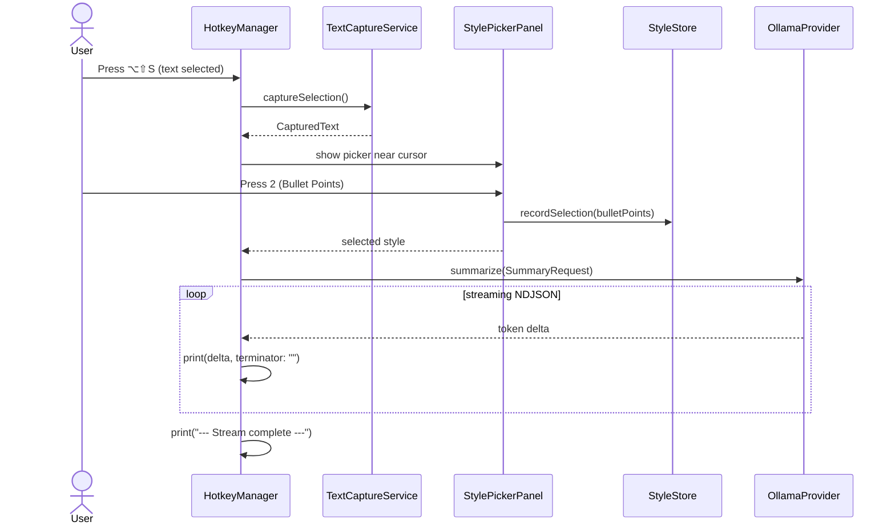

# TextSummarizer — Handoff Document: Milestone 2, Increment B

**Date:** 2026-09-10  
**Status:** Increment B complete. Build succeeds. Selecting text + picking a style streams Ollama response tokens to the Xcode console.

---

## 1. What Was Built

Increment B adds an **Ollama LLM provider** and wires it into the hotkey flow.

- Protocol-first provider layer (`LLMProvider`).
- `OllamaProvider` that calls `GET /api/tags` and streams `POST /api/chat` via NDJSON.
- `SummaryRequest` model that bundles style, captured text, model, max tokens, and temperature.
- `OllamaError` with friendly, localized messages.
- `StreamParsers` utility for NDJSON line parsing.
- `HotkeyManager` now streams tokens to the console after a style is selected.
- Default model set to `phi3:instruct` (per user request); model selector UI is deferred.

This increment intentionally does **not** show a popup UI yet. Output is console-only; the popup is Increment C.

---

## 2. New Files

| File | Responsibility |
| :--- | :--- |
| `Providers/LLMProvider.swift` | `LLMProvider` protocol: `displayName`, `listModels()`, `summarize(_:)`. |
| `Providers/OllamaProvider.swift` | Ollama implementation with `/api/tags` and streaming `/api/chat`. |
| `Providers/OllamaError.swift` | `LocalizedError` cases: `.notRunning`, `.modelNotFound`, `.decodingFailed`, `.unexpectedStatus`, `.serverMessage`. |
| `Models/SummaryRequest.swift` | Request payload built from captured text + selected style. |
| `Utilities/StreamParsers.swift` | Decodable `NDJSONLine` for Ollama stream chunks. |

## 3. Modified Files

| File | Changes |
| :--- | :--- |
| `Core/HotkeyManager.swift` | Accepts an `LLMProvider`; streams summary tokens to the console after style selection. |
| `App/TextSummarizerApp.swift` | Creates a single `OllamaProvider` and injects it into `HotkeyManager`. |
| `UI/StylePicker/StylePickerPanel.swift` | Fixed latent build errors: moved `positionPanelNearCursor` inside the class and updated `canBecomeKeyWindow`/`canBecomeMainWindow` to `canBecomeKey`/`canBecomeMain`. |

---

## 4. How It Works

### Flow



### Key implementation details

- `OllamaProvider.defaultModel` is `phi3:instruct`.
- `OllamaProvider.defaultBaseURL` is `http://localhost:11434`.
- `SummaryRequest.userMessage` substitutes `{{text}}` via `SummaryStyle.prompt(for:)`.
- Streaming uses `URLSession.shared.bytes(for:)` and `AsyncBytes.lines`.
- The provider maps URL-session connection errors to `OllamaError.notRunning`.
- A `404` response from `/api/chat` maps to `OllamaError.modelNotFound`.

---

## 5. Current State & Verification

### Build

- Clean build succeeds via `xcodebuild`.
- Deployment target remains macOS 13.0.
- App Sandbox is disabled.

### Manual tests to run

1. **Happy path:**
   - Make sure Ollama is running: `ollama serve`.
   - Pull the default model: `ollama pull phi3:instruct`.
   - Select text in Safari and press `⌥⇧S`.
   - Pick a style (e.g., `2` for Bullet Points).
   - Watch Ollama tokens stream into the Xcode console.

2. **Ollama not running:**
   - Stop Ollama.
   - Trigger the flow.
   - Console should show: "Ollama does not appear to be running."

3. **Model not found:**
   - Run `ollama rm phi3:instruct`.
   - Trigger the flow.
   - Console should show: "Model 'phi3:instruct' was not found. Run `ollama pull phi3:instruct` and try again."

### Known limitations

1. **Output is console-only.** The popup UI is Increment C.
2. **Model is hardcoded.** `phi3:instruct` is the default; model selector comes in Increment E.
3. **No settings persistence.** Base URL and model are not yet configurable through a UI.
4. **No cancellation UI.** The stream cancels only when the panel closes; a dedicated cancel action is Increment C.
5. **No retry UI.** Error messages print to the console; retry will be part of the popup in Increment C.

---

## 6. Bugs Fixed During This Increment

### `StylePickerPanel` scoping error

**Symptom:** `positionPanelNearCursor` was defined at top level, producing `extraneous '}' at top level` on the final brace.

**Fix:** Moved `positionPanelNearCursor` and the `// MARK: - Positioning` comment inside `StylePickerPanel`.

### Deprecated `NSPanel` key-window properties

**Symptom:** Build error: `'canBecomeKeyWindow' has been renamed to 'canBecomeKey'`.

**Fix:** Updated `KeyablePanel` to override `canBecomeKey` and `canBecomeMain`.

---

## 7. Recommended Next Steps

Increment B is complete. The next logical increment is **Increment C — Summary popup**:

1. Create `Core/SummarizationOrchestrator.swift` to own the state machine.
2. Create `UI/Popup/SummaryPopup.swift` (non-activating `NSPanel`).
3. Create `UI/Popup/SummaryPopupView.swift` with MarkdownUI streaming render.
4. Replace console output with the popup; add Copy and Regenerate actions.

**Definition of done for Increment C:** Select text → pick style → see the summary stream into a floating popup near the cursor.

---

## 8. Important Notes for the Next Session

### Before you run

1. Open `TextSummarizer.xcodeproj` in Xcode.
2. Select **My Mac** as the run destination.
3. Build with `Command-B`.
4. Run with `Command-R`.
5. Make sure Ollama is running and `phi3:instruct` is pulled:
   ```bash
   ollama pull phi3:instruct
   ```
6. Select text in any app and press `⌥⇧S`, then pick a style.
7. Watch the Xcode console for streamed tokens.

### If capture stops working

See the notes in [handoff-milestone-2-increment-a.md](handoff-milestone-2-increment-a.md).

### If Ollama is not responding

- Check `ollama list` to confirm `phi3:instruct` is available.
- Check that Ollama is reachable: `curl http://localhost:11434/api/tags`.
- The app reports connection errors as user-facing messages in the console for now.

---

## 9. Code Patterns to Follow

- Keep the **protocol-first** architecture (`TextCapturing`, `LLMProvider`).
- Use `@MainActor` for UI and Accessibility entry points.
- Use `Sendable` conformance for models that cross async boundaries.
- Surface provider errors as `LocalizedError` cases.
- Keep network parsing isolated in `Utilities` so it is easy to unit test.

---

## 10. Open Questions from the PRD

1. **Default model:** Currently `phi3:instruct` as requested; revisit when the model selector is added.
2. **Output folder:** Still `~/Documents/Text Summarizer/` for Increment D.
3. **History:** Remains P2 for Milestone 3.
4. **Custom Prompt editor:** UI deferred until after provider support is solid.
