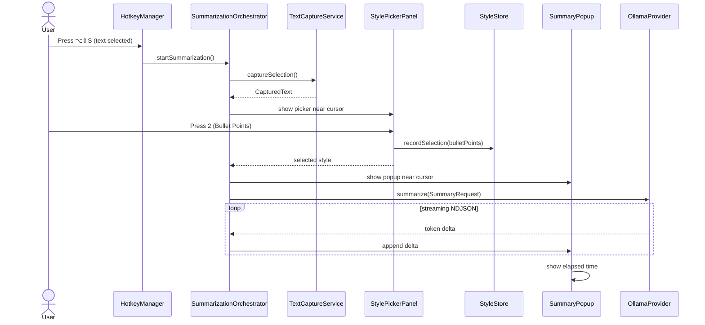

# TextSummarizer — Handoff Document: Milestone 2, Increment C

**Date:** 2026-09-10  
**Status:** Increment C complete. Build succeeds. Selecting text + picking a style streams the Ollama summary into a floating Markdown popup.

---

## 1. What Was Built

Increment C replaces console output with a **floating summary popup**.

- `SummarizationOrchestrator` owns the full capture → picker → provider → popup flow.
- `SummaryPopup` / `SummaryPopupView` render the streamed Markdown in a non-activating, resizable panel.
- Toolbar actions: **Copy** (⌘C), **Regenerate** (⌘R), and a **Style** dropdown.
- `SummaryPopupViewModel` holds all observable popup state.
- `KeyablePanel` is now a shared `NSPanel` subclass used by both the style picker and the popup.
- Provider errors (`OllamaError.notRunning`, `modelNotFound`, etc.) now surface in the popup instead of the console.
- `HotkeyManager` is simplified: it only registers the global shortcut and forwards triggers to the orchestrator.

This increment intentionally does **not** include Save-as-Markdown; that is Increment D.

---

## 2. New Files

| File | Responsibility |
| :--- | :--- |
| `Core/SummarizationOrchestrator.swift` | `@MainActor` state machine: capture, picker, popup, streaming task. |
| `UI/Popup/SummaryPopup.swift` | Non-activating `NSPanel` wrapper (520×360 default, 320×240 min). |
| `UI/Popup/SummaryPopupView.swift` | SwiftUI content: Markdown stream, toolbar, error banner, duration footer. |
| `UI/Popup/SummaryPopupViewModel.swift` | `ObservableObject` state: text, style, streaming flag, error, elapsed time, actions. |
| `UI/Shared/KeyablePanel.swift` | Shared `NSPanel` subclass: `canBecomeKey == true`, `canBecomeMain == false`. |

## 3. Modified Files

| File | Changes |
| :--- | :--- |
| `App/TextSummarizerApp.swift` | Creates and keeps `SummarizationOrchestrator` alive; injects it into `HotkeyManager`. |
| `Core/HotkeyManager.swift` | Stripped picker/stream logic; now delegates to the orchestrator. |
| `UI/StylePicker/StylePickerPanel.swift` | Removed private `KeyablePanel`; now uses the shared one. |

---

## 4. How It Works

### Flow



### Key implementation details

- `SummaryPopup` is a titled, closable, resizable, **non-activating** `NSPanel` so it does not steal focus.
- The popup opens at 520×360 near the cursor, clamped to the visible screen frame.
- `MarkdownUI` renders the streamed text live; the view auto-scrolls to the bottom as tokens arrive.
- `SummarizationOrchestrator` keeps one active popup and one active `Task` at a time. A new request cancels and replaces the previous one.
- Copy puts the full Markdown summary on `NSPasteboard.general`.
- Regenerate re-runs the request with the current style.
- The Style dropdown re-runs the request with a new style and records it in `StyleStore`.

---

## 5. Current State & Verification

### Build

- Clean build succeeds via `xcodebuild`.
- Deployment target remains macOS 13.0.
- App Sandbox is disabled.

### Manual tests to run

1. **Happy path:**
   - Make sure Ollama is running: `ollama serve`.
   - Pull the default model: `ollama pull phi3:instruct`.
   - Select text in Safari and press `⌥⇧S`.
   - Pick a style (e.g., `2` for Bullet Points).
   - A popup appears near the cursor and streams Markdown bullets.
   - The footer shows "Streaming…" and then elapsed seconds.

2. **Copy:**
   - After streaming completes, click **Copy** (or press `⌘C`).
   - Paste into Notes: the full Markdown summary should appear.

3. **Regenerate:**
   - Click **Regenerate** (or press `⌘R`).
   - The popup clears and re-streams the same request.

4. **Style switcher:**
   - Use the top toolbar dropdown to switch to **TL;DR**.
   - The popup clears and re-streams with the new style.

5. **Ollama not running:**
   - Stop Ollama.
   - Trigger the flow.
   - The popup shows an error banner: "Ollama does not appear to be running."

6. **Model not found:**
   - Run `ollama rm phi3:instruct`.
   - Trigger the flow.
   - The popup shows: "Model 'phi3:instruct' was not found. Run `ollama pull phi3:instruct` and try again."

7. **Single-popup rule:**
   - With a popup already open, press `⌥⇧S` again and pick a style.
   - The old popup closes and a new one streams.

8. **Focus preservation:**
   - While the popup streams, the previous app (e.g., Safari) remains active.

### Known limitations

1. **Save-as-Markdown is not implemented.** That is Increment D.
2. **Model is still hardcoded.** `phi3:instruct` is the default; model selector comes in Increment E.
3. **No settings persistence.** Base URL and model are not yet configurable through a UI.
4. **Capture errors still print to the console.** A user-facing error UI for capture failures may be added later if needed.
5. **Popup title does not update when the style is switched.** It keeps the initially chosen style's name.

---

## 6. Bugs Fixed During This Increment

None — this increment is new functionality.

---

## 7. Recommended Next Steps

Increment C is complete. The next logical increment is **Increment D — Save as Markdown**:

1. Create `Models/SummaryResult.swift` to hold final summary, source app, timestamps, and style.
2. Create `Utilities/MarkdownWriter.swift` to build YAML frontmatter and write the `.md` file.
3. Add **Save as Markdown** (⌘S) and **Save As…** (⌥⇧S) buttons to `SummaryPopupView`.
4. Pass the needed metadata from `SummarizationOrchestrator` to the writer.

**Definition of done for Increment D:** Press `⌘S` in the popup → a `.md` file is written to `~/Documents/Text Summarizer/` with correct YAML frontmatter and filename `yyyy-MM-dd-HHmmss-<style-slug>.md`.

---

## 8. Important Notes for the Next Session

### Before you run

1. Open `TextSummarizer.xcodeproj` in Xcode.
2. Select **My Mac** as the run destination.
3. Build with `Command-B`.
4. Run with `Command-R`.
5. Make sure Ollama is running and `phi3:instruct` is pulled:
   ```bash
   ollama pull phi3:instruct
   ```
6. Select text in any app and press `⌥⇧S`, then pick a style.
7. The summary should stream into the popup near the cursor.

### If capture stops working

See the notes in [handoff-milestone-2-increment-a.md](handoff-milestone-2-increment-a.md).

### If Ollama is not responding

- Check `ollama list` to confirm `phi3:instruct` is available.
- Check that Ollama is reachable: `curl http://localhost:11434/api/tags`.
- The app surfaces connection errors in the popup's error banner.

---

## 9. Code Patterns to Follow

- Keep the **protocol-first** architecture (`TextCapturing`, `LLMProvider`).
- Use `@MainActor` for UI and Accessibility entry points.
- Use `Sendable` conformance for models that cross async boundaries.
- Surface provider errors as `LocalizedError` cases in the UI.
- Keep network parsing isolated in `Utilities` so it is easy to unit test.
- Avoid bloating `HotkeyManager`; new flows should be owned by an orchestrator.

---

## 10. Open Questions from the PRD

1. **Default model:** Currently `phi3:instruct` as requested; revisit when the model selector is added.
2. **Output folder:** Still `~/Documents/Text Summarizer/` for Increment D.
3. **History:** Remains P2 for Milestone 3.
4. **Custom Prompt editor:** UI deferred until after provider support is solid.
