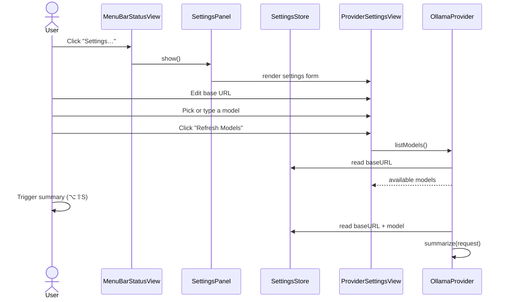

# TextSummarizer — Handoff Document: Milestone 2, Increment D

**Date:** 2026-09-11
**Status:** Increment D complete. Build succeeds. The user can change the Ollama base URL and model from a Settings window.

---

## 1. What Was Built

Increment D adds a **Settings window** for the Ollama provider.

- `SettingsStore` persists the Ollama base URL and model in `UserDefaults`.
- `ProviderSettingsView` shows a form with:
  - Editable **Base URL** text field.
  - **Model picker** populated from the running Ollama server.
  - **Refresh Models** button.
  - Fallback text field when Ollama is not reachable.
- `SettingsView` wraps `ProviderSettingsView`.
- `SettingsPanel` hosts the settings view in a floating `NSPanel` because SwiftUI's `Settings` scene does not integrate with `MenuBarExtra` apps on macOS 13.
- `OllamaProvider` now reads its configuration from `SettingsStore` instead of hardcoded values.
- `SummaryRequest` no longer carries the model name; the provider owns that.
- The menu-bar **Settings…** button opens the floating settings panel.

---

## 2. New Files

| File | Responsibility |
| :--- | :--- |
| `Stores/SettingsStore.swift` | `@MainActor` `UserDefaults` wrapper for base URL and model. |
| `UI/Settings/ProviderSettingsView.swift` | SwiftUI form: base URL, model picker, refresh button. |
| `UI/Settings/SettingsWindow.swift` | Root `SettingsView` wrapping `ProviderSettingsView`. |
| `UI/Settings/SettingsPanel.swift` | Floating `NSPanel` that hosts the settings view. |

## 3. Modified Files

| File | Changes |
| :--- | :--- |
| `App/TextSummarizerApp.swift` | Creates `SettingsStore`; injects it into `OllamaProvider`; owns a `SettingsPanel`; passes `onSettings` to the menu bar. |
| `Providers/OllamaProvider.swift` | Reads base URL and model from `SettingsStore`; removes hardcoded defaults. |
| `Models/SummaryRequest.swift` | Removes `model` property; provider now chooses the model. |
| `Core/SummarizationOrchestrator.swift` | Creates `SummaryRequest` without a model. |
| `UI/MenuBar/MenuBarStatusView.swift` | "Settings…" button opens the preferences window. |

---

## 4. How It Works

### Flow



### Key implementation details

- `SettingsStore` uses `@Published` properties with `didSet` observers so edits are saved to `UserDefaults` immediately.
- `OllamaProvider` captures the current base URL and model at the start of each async operation using `await MainActor.run { ... }`. This keeps `SettingsStore` on the main actor while network work runs on the cooperative pool.
- `SettingsStore` is marked `@unchecked Sendable` so it can be held by the `Sendable` `LLMProvider`.
- The model picker fetches from `/api/tags` when the view appears and when the user clicks **Refresh Models**.
- If the model fetch fails (for example, Ollama is not running), a plain text field is shown with an error message so the user can still type a model name.

---

## 5. Current State & Verification

### Build

- Clean build succeeds via `xcodebuild`.
- Deployment target remains macOS 13.0.
- App Sandbox is disabled.

### Manual tests to run

1. **Open settings:**
   - Click the menu-bar icon.
   - Click **Settings…**.
   - The Preferences window opens.

2. **Change model:**
   - Make sure Ollama is running and has more than one model, e.g.:
     ```bash
     ollama pull phi3:instruct
     ollama pull llama3.1:8b
     ```
   - Open Settings and wait for the model picker to populate.
   - Select a different model.
   - Trigger a summary.
   - Verify the request uses the selected model (check the popup or network traffic).

3. **Change base URL:**
   - Open Settings.
   - Change the base URL, for example to `http://127.0.0.1:11434`.
   - Click **Refresh Models**.
   - Verify models are fetched from the new URL.

4. **Persistence:**
   - Change the base URL and model.
   - Quit the app.
   - Reopen the app.
   - Open Settings and confirm the values were saved.

5. **Offline fallback:**
   - Stop Ollama.
   - Open Settings.
   - The model picker should show an error and fall back to a text field.
   - Type a model name.
   - The value is still saved and used on the next summary.

6. **Existing popup flow still works:**
   - Run the Increment C manual tests and confirm the summary popup still streams correctly.

### Known limitations

1. **Model picker does not auto-refresh when the base URL changes.** The user must click **Refresh Models** after editing the URL.
2. **Base URL validation is minimal.** Invalid URLs are ignored; only valid `URL(string:)` results with a scheme are saved.
3. **No other providers yet.** The settings UI is Ollama-specific because that is the only provider implemented.
4. **Capture errors still print to the console.** A user-facing error UI for capture failures may be added later if needed.

---

## 6. Bugs Fixed During This Increment

None — this increment is new functionality.

---

## 7. Recommended Next Steps

Increment D is complete. The next logical increment is **Save as Markdown** (deferred from the original Milestone 2 plan):

1. Create `Models/SummaryResult.swift` to hold final summary, source app, timestamps, and style.
2. Create `Utilities/MarkdownWriter.swift` to build YAML frontmatter and write the `.md` file.
3. Add **Save as Markdown** (⌘S) and **Save As…** (⌥⇧S) buttons to `SummaryPopupView`.
4. Pass the needed metadata from `SummarizationOrchestrator` to the writer.

**Definition of done:** Press `⌘S` in the popup → a `.md` file is written to `~/Documents/Text Summarizer/` with correct YAML frontmatter and filename `yyyy-MM-dd-HHmmss-<style-slug>.md`.

---

## 8. Important Notes for the Next Session

### Before you run

1. Open `TextSummarizer.xcodeproj` in Xcode.
2. Select **My Mac** as the run destination.
3. Build with `Command-B`.
4. Run with `Command-R`.
5. Make sure Ollama is running and your preferred model is pulled.
6. Open Settings from the menu bar and verify the base URL and model.
7. Select text in any app and press `⌥⇧S`, then pick a style.
8. The summary should stream into the popup using the configured model.

### If capture stops working

See the notes in [handoff-milestone-2-increment-a.md](handoff-milestone-2-increment-a.md).

### If Ollama is not responding

- Check `ollama list` to confirm the model is available.
- Check that Ollama is reachable: `curl http://localhost:11434/api/tags`.
- Open Settings and confirm the base URL matches your Ollama server.
- The app surfaces connection errors in the popup's error banner.

---

## 9. Code Patterns to Follow

- Keep the **protocol-first** architecture (`TextCapturing`, `LLMProvider`).
- Use `@MainActor` for UI and `ObservableObject` stores.
- Use `Sendable` conformance for models that cross async boundaries.
- Surface provider errors as `LocalizedError` cases in the UI.
- Read settings values on the main actor before starting network work.
- Avoid bloating `HotkeyManager`; new flows should be owned by an orchestrator.

---

## 10. Open Questions from the PRD

1. **Default model:** Currently `phi3:instruct` as requested; revisit when the model selector is added.
2. **Output folder:** Still `~/Documents/Text Summarizer/` for the Save-as-Markdown increment.
3. **History:** Remains P2 for Milestone 3.
4. **Custom Prompt editor:** UI deferred until after provider support is solid.
