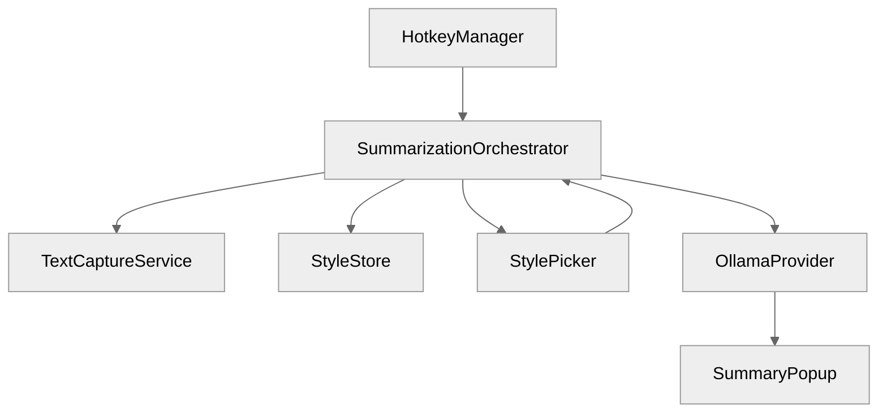

# TextSummarizer — Milestone 2 Plan

**Goal:** Make the app summarize selected text and show the result in a popup. The user can copy the summary from the popup.

**Scope:** Ollama provider only. OpenAI-compatible providers and history come later.

**Estimated time:** 1–2 weeks.

---

## 1. What Milestone 2 Will Build

After Milestone 2, the full user flow is:

1. Select text in any app.
2. Press `⌥⇧S`.
3. A small style picker appears.
4. Pick a style (for example, `2` for Bullet Points).
5. A popup opens near the cursor and streams the summary from Ollama.
6. Press `⌘C` (or click the Copy button) to copy the summary.

Milestone 2 intentionally does **not** include:

- OpenAI-compatible providers.
- Custom styles editor.
- History browser.
- Auto-save.
- `⌥⇧D` default-style shortcut.
- Save as Markdown.

These are planned for Milestone 3.

---

## 2. Increments

We build Milestone 2 in four small increments. Each increment is independently testable.

### Increment A — Style picker

**Goal:** After capturing text, show a compact style picker near the cursor.

**New files:**

- `TextSummarizer/Models/SummaryStyle.swift` — Defines a style: name, shortcut key, prompt template.
- `TextSummarizer/Stores/StyleStore.swift` — Holds the built-in styles and remembers the last-used style.
- `TextSummarizer/UI/StylePicker/StylePickerPanel.swift` — A small non-activating panel that lists styles.
- `TextSummarizer/UI/StylePicker/StylePickerView.swift` — SwiftUI content of the picker.

**Changes to existing files:**

- `HotkeyManager.swift` — After capture, open the style picker instead of printing to the console.

**Definition of done:**

- Press `⌥⇧S` with text selected.
- A picker appears with the six built-in styles from the PRD.
- Pressing `2` selects Bullet Points and prints the prompt to the console.
- Pressing `Escape` closes the picker and does nothing.

---

### Increment B — Ollama provider

**Goal:** Send the captured text and chosen style to a local Ollama instance and stream the response.

**New files:**

- `TextSummarizer/Providers/LLMProvider.swift` — Protocol for all providers.
- `TextSummarizer/Providers/OllamaProvider.swift` — Ollama implementation.
- `TextSummarizer/Models/SummaryRequest.swift` — Request data: style, text, model, max tokens, temperature.
- `TextSummarizer/Utilities/StreamParsers.swift` — Parses NDJSON lines from Ollama.

**Changes to existing files:**

- `StyleStore.swift` — Add a method that builds the final prompt by replacing `{{text}}` with the captured text.
- `HotkeyManager.swift` — Wire the chosen style into a new orchestrator.

**Definition of done:**

- Select text → pick a style.
- Ollama response tokens print to the Xcode console as they arrive.
- If Ollama is not running, the user sees a friendly error message.

---

### Increment C — Summary popup

**Goal:** Show the streaming summary in a floating popup instead of the console.

**New files:**

- `TextSummarizer/UI/Popup/SummaryPopup.swift` — Non-activating `NSPanel` at the cursor.
- `TextSummarizer/UI/Popup/SummaryPopupView.swift` — SwiftUI content: Markdown stream, toolbar buttons.
- `TextSummarizer/Core/SummarizationOrchestrator.swift` — Coordinates capture → style → provider → popup.

**Changes to existing files:**

- `HotkeyManager.swift` — Use the orchestrator. Remove direct `print` calls.
- `TextSummarizerApp.swift` — Keep the orchestrator alive as a `@StateObject`.

**Definition of done:**

- Summarization result appears in a popup at the cursor.
- Markdown streams live as tokens arrive.
- The popup has Copy and Regenerate buttons.

---

### Increment D — Settings foundation

**Goal:** Add a Settings window so the user can change the Ollama base URL and model.

**New files:**

- `TextSummarizer/Stores/SettingsStore.swift` — `UserDefaults` wrapper.
- `TextSummarizer/UI/Settings/SettingsWindow.swift` — Settings window.
- `TextSummarizer/UI/Settings/ProviderSettingsView.swift` — Ollama URL and model picker.

**Changes to existing files:**

- `MenuBarStatusView.swift` — Add a "Settings…" menu item.
- `OllamaProvider.swift` — Read base URL and model from `SettingsStore`.
- `TextSummarizerApp.swift` — Keep the settings store alive.

**Definition of done:**

- Click "Settings…" in the menu bar.
- Change the Ollama base URL or model.
- The next summary uses the new values.

---

### Deferred to Milestone 3 — Save as Markdown

**Goal:** Save the popup content as a timestamped Markdown file with YAML frontmatter.

> Moved out of Milestone 2 because the Copy button in the popup is enough for now.

**New files:**

- `TextSummarizer/Utilities/MarkdownWriter.swift` — Builds frontmatter and writes the `.md` file.
- `TextSummarizer/Models/SummaryResult.swift` — Holds the final summary, source info, timestamps, etc.

**Changes to existing files:**

- `SummaryPopupView.swift` — Add "Save as Markdown" (`⌘S`) and "Save As…" (`⌥⇧S`) buttons.
- `SummarizationOrchestrator.swift` — Pass all needed metadata to the writer.

**Definition of done:**

- Press `⌘S` in the popup.
- A `.md` file is written to `~/Documents/Text Summarizer/`.
- The filename matches `yyyy-MM-dd-HHmmss-<style-slug>.md`.
- The file contains correct YAML frontmatter.

---

## 3. New Module Layout

```text
TextSummarizer/
├── App/
│   └── TextSummarizerApp.swift
├── Core/
│   ├── HotkeyManager.swift
│   ├── TextCaptureService.swift
│   └── SummarizationOrchestrator.swift   ← new
├── Models/
│   ├── CapturedText.swift
│   ├── CaptureError.swift
│   ├── SummaryStyle.swift                ← new
│   └── SummaryRequest.swift              ← new
├── Providers/
│   ├── LLMProvider.swift                 ← new
│   └── OllamaProvider.swift              ← new
├── Stores/
│   ├── StyleStore.swift                  ← new
│   └── SettingsStore.swift               ← new
├── UI/
│   ├── MenuBar/
│   │   └── MenuBarStatusView.swift
│   ├── StylePicker/
│   │   ├── StylePickerPanel.swift        ← new
│   │   └── StylePickerView.swift         ← new
│   ├── Popup/
│   │   ├── SummaryPopup.swift            ← new
│   │   └── SummaryPopupView.swift        ← new
│   └── Settings/
│       ├── SettingsWindow.swift          ← new
│       └── ProviderSettingsView.swift    ← new
└── Utilities/
    └── StreamParsers.swift               ← new
```

---

## 4. Architecture



**Responsibilities:**

- `SummarizationOrchestrator` owns the state machine: idle → capturing → picking style → streaming → complete.
- `StyleStore` provides built-in styles and remembers the last choice.
- `OllamaProvider` implements the `LLMProvider` protocol.
- `SummaryPopup` is a non-activating `NSPanel` that renders Markdown with `MarkdownUI`. It also exposes a Copy button so the user can copy the summary without saving.

---

## 5. Definition of Done for Milestone 2

- [ ] Select text in Safari → press `⌥⇧S` → style picker appears.
- [ ] Choose a style → popup opens at cursor and streams the Ollama summary.
- [ ] Works offline with a local Ollama model.
- [ ] Friendly errors for missing Accessibility permission, no selection, Ollama not running, and model not found.
- [ ] Settings window lets the user change Ollama URL and model.
- [ ] Unit tests for prompt templating and NDJSON parsing.

---

## 6. Testing Plan

| Type | What to test |
| :--- | :--- |
| Unit | Prompt template substitution with `{{text}}`. NDJSON line parsing. |
| Manual | Capture → picker → popup flow in Safari, Notes, TextEdit, Word. |
| Error paths | Ollama stopped, model not pulled, no selection, permission revoked. |
| Performance | First token visible in under 2 seconds on Apple Silicon with a warm 8B model. |

---

## 7. Risks and How to Handle Them

| Risk | Mitigation |
| :--- | :--- |
| Ollama not installed on the test Mac | Document setup in `setup-guide.md`. Test with `ollama run llama3.1:8b` first. |
| Non-activating panel does not show over full-screen apps | Test early. Adjust `NSPanel` level and style mask if needed. |
| Streaming Markdown flickers | Use `MarkdownUI` correctly. Append text to a single string, do not rebuild the whole view on every token. |
| Simulated `⌘C` still needed for some apps | Keep the existing fallback. Do not remove it. |

---

## 8. Open Questions

1. Should the popup appear at the mouse cursor or at the center of the frontmost window? Start with mouse cursor.
2. Should the popup auto-close when the user clicks outside? Start with no auto-close, so the user can read and copy.
3. Which Ollama model should be the default? Use `llama3.1:8b` as the PRD recommends.

---

## 9. Recommended Order of Work

1. **Increment A** — Style picker. This gives immediate user feedback.
2. **Increment B** — Ollama provider. This connects the app to a real LLM.
3. **Increment C** — Summary popup. This replaces console output with a real UI.
4. **Increment D** — Settings foundation. This makes the provider configurable.

Start with **Increment A** in the next session.
